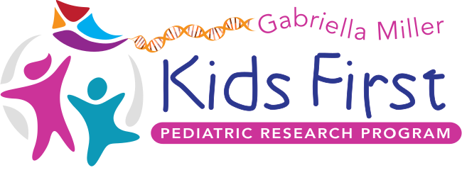

<p align="center">
  
</p>
<p align="center">
  <a href="https://github.com/kids-first/kf-api-fhir-service/blob/master/LICENSE"></a>
  <a href="https://circleci.com/gh/kids-first/kf-api-fhir-service"></a>
</p>

# 🔥 FHIR Services

FHIR data service for Include DCC and Kids First uses the
[Smile CDR FHIR server](https://smilecdr.com/docs/).

## 🔢 Version

The current version of the FHIR servers is Smile CDR 2023.02.R02 (Wizard).
See [changelogs](https://smilecdr.com/docs/introduction/changelog.html) for details

## 🚀 Deployments

### Kids First
Kids First FHIR services have been deployed into the DEV and QA environments
within the Kids First Strides AWS account.

The FHIR endpoints for each of these environments are:

- DEV: https://kf-api-fhir-service-upgrade-dev.kf-strides.org
- QA: https://kf-api-fhir-service-upgrade-qa.kf-strides.org
- (Not deployed yet) PRD: https://kf-api-fhir-service-upgrade.kf-strides.org

### Include DCC 
Include DCC FHIR services have been deployed into the DEV and QA environments
within the Include DCC AWS account.

The FHIR endpoints for each of these environments are:

- DEV: https://include-api-fhir-service-upgrade-dev.includedcc.org
- QA: https://include-api-fhir-service-upgrade-qa.includedcc.org
- (Not deployed yet) PRD: https://include-api-fhir-service-upgrade.includedcc.org

## 🧓🏻 Legacy Servers
The old servers are still deployed and will be maintained until we fully
transition to the new servers mentioned above. 
Documentation for the old servers can be found here: [README.md](docs/legacy/README.md)

Key feature differences between the legacy servers and upgraded servers are:

|                           | **Legacy** | **Upgraded** |
|---------------------------|------------|--------------|
| **OAuth2 Authentication** |      ❌     |       ✅      |
| **Custom Authorization**  |      ❌     |       ✅      |
| **Swagger API docs**      |      ❌     |       ✅      |
| **Auditing**              |      ❌     |       ✅      |

**Important Note:** Although custom authorization and auditing is supported in the new 
FHIR servers, we have not yet implemented or enabled those features.

## 🧑‍💻 Quickstart - API Users

### Register for Access

These FHIR services support OIDC based authentication using
the [OAuth2 Client Credentials Flow](https://auth0.com/docs/get-started/authentication-and-authorization-flow/client-credentials-flow).
We use the open source OIDC provider [Keycloak](https://www.keycloak.org/).

In order to begin interacting with the server you will need to register a new client.
Please email or slack one of the Keycloak admins:

1. Alex Lubneuski (lubneuskia@chop.edu)
2. Natasha Singh (singhn4@chop.edu)

Please include:
1. Preferred client_id value
2. Which environment you wish to access (dev, qa, prd)
3. Whether you need read/write/both access

Once you've registered you will receive:
```
token_url: url to get tokens from
client_id: your client id
client_secret: your client secret
```

These client credentials can be used to get a token which will work for any 
of the KF/INCLUDE servers deployed in either DEV/QA. 

Please keep the client secret securely and privately stored!

### FHIR API Access 

Any machine wanting to access the FHIR service must authenticate by providing
a valid OAuth2 access token issued by the OIDC provider. Here we will walk 
through an example of how any request to the server will be made.

### Get the Access Token
Let's pretend we have registered a client in the QA environment with the following 
credentials and then use these to get the access token from Keycloak:

```shell
client_id: myclient
client_secret: mysecret
token_url: https://kf-keycloak-qa.kf-strides.org/auth/realms/FHIR-TEST/protocol/openid-connect/token
```

```shell
curl -X POST -d "client_id=myclient&client_secret=mysecret&grant_type=client_credentials" \
    -H "Content-Type: application/x-www-form-urlencoded" \
    https://kf-keycloak-qa.kf-strides.org/auth/realms/FHIR-TEST/protocol/openid-connect/token
```

You will get something that looks like this:

```json
{
  "access_token": <long base64 encoded string removed for brevity>,
  "expires_in": 3600,
  "refresh_expires_in": 0,
  "token_type": "Bearer",
  "not-before-policy": 0,
  "scope": "email profile fhir"
}
```

### Use Token to Make Requests 

Now you can use this token to authenticate with the FHIR server and make requests.

```shell
curl -X GET -H 'Content-Type: application/json' \
-H 'Authorization: Bearer <put access token here>'\ 
https://kf-api-fhir-service-upgrade-qa.kf-strides.org/Patient
```

**Note** that your code will need to include logic that requests a new token 
after the current token expires.

## 👩‍💻  Quickstart - API Developers

The quickstart script bootstraps the development environment, seeds the FHIR server
with data, and sets up Keycloak with clients that have been assigned FHIR 
permissions. Run this script if you want to get up and running quickly and see
how everything works.

### Precursor
Please make sure you have [Docker](https://docs.docker.com/desktop/) 
installed on your system and it is running. 

### Setup
```shell
./src/bin/quickstart.sh --delete-volumes
```

If everything ran correctly, you should see this in your shell:

```shell
✅ --- Quickstart setup complete! ---
```

### Get Access Token 
Let's try getting an access token from Keycloak for the `ingest-study-client`
client. 

```shell
curl -X POST -H 'Content-Type: application/json' \
-d '{"client_id": "ingest-study-client","client_secret": "lkhZRex5E58JCjcnIKkLcT4t1Q9dw5OW"}' \
http://localhost:8081/keycloak-proxy/token
```

### 💡 Important Note About Keycloak
You may notice the instructions to get the access token are different here 
in the Developer section than the Quickstart secion.

Unfortunately we cannot send requests directly to Keycloak to get access tokens
since Keycloak will then use "localhost" in the access token's issuer field 
(ex. `http://localhost:8080/realms/fhir-dev/protocol/openid-connect/token`).

Then when this access token is sent to Smile CDR inside the docker stack, it 
will fail since Smile CDR inside the docker network does not know what 
`http://localhost:8080` is. 

To mitigate this we simply send requests to the proxy service which then 
forwards the request to the Keycloack docker service. 

### Inspect Token
You should get back a response that looks like this (access token removed 
for brevity):
```json
{
  "access_token": <access_token>,
  "decoded_token": {
    "acr": "1",
    "allowed-origins": [
      "/*"
    ],
    "azp": "ingest-study-client",
    "clientAddress": "192.168.176.4",
    "clientHost": "192.168.176.4",
    "clientId": "ingest-study-client",
    "email_verified": false,
    "exp": 1681241247,
    "fhir_roles": [
      "fhir-permission|role-fhir-client-superuser"
    ],
    "iat": 1681237647,
    "iss": "http://keycloak:8080/realms/fhir-dev",
    "jti": "40b44b13-9b07-45c1-9432-ee1c17ebdab2",
    "preferred_username": "service-account-ingest-study-client",
    "scope": "fhir profile email",
    "sub": "7a25c1e2-5403-476b-ab13-00acc1693a75",
    "typ": "Bearer"
  },
  "expires_in": 3600,
  "not-before-policy": 0,
  "refresh_expires_in": 0,
  "scope": "fhir profile email",
  "token_type": "Bearer"
}

```
The actual base64 encoded access token needed to send requests to the 
FHIR server will be in `access_token` but you can see the decoded version of 
it in `decoded_token`. In the decoded version you can see the FHIR permissions 
this client has.

### View Data
Let's use the access token to view the FHIR data we are now authorized to see:

```shell
curl -X GET -H 'Content-Type: application/json' \
-H 'Authorization: Bearer <put access token here>'\ 
http://localhost:8000/Patient
```

You should get back the Patients that were added by the quickstart script.

## 🐛 Smile CDR Tickets
If you find issues with Smile CDR itself, talk to a repo admin and/or ask for 
credentials to the Smile CDR support website. The engineers there are very 
responsive and helpful.

https://support.smilecdr.com/

## 🐳 New Docker Images 
Smile CDR periodically releases new versions in the form of tarballs or docker 
images. Talk to a repo admin and/or ask for the CHOP credentials to access the
releases website to download new images:

https://releases.smilecdr.com/

## 💻 Codebase

## Smile CDR
All server settings are located in `smilecdr/settings`

```
smilecdr
`-- settings
    |-- auth.js
    |-- master.properties
    |-- oidc-servers.json
    |-- jvmargs.sh
    |-- system-users.json
    `-- users.json
```

### auth.js

- The post authentication callback function that Smile CDR calls once the user 
has been authenticated. This function is responsible for extracting FHIR 
roles and permissions from the access token (in the case of OIDC) or
user object (in the case of basic auth) and adding it to the user session.

- See https://smilecdr.com/docs/security/callback_scripts.html#method-onauthenticatesuccess

### master.properties 

- This is the main configuration file for the server.

- See https://smilecdr.com/docs/configuration_categories for details on each 
property.

### oidc-servers.json 

- A list of configuration objects for each OIDC server that you want Smile CDR
to be aware of. Local Keycloak configuration is included.

- See https://smilecdr.com/docs/configuration_categories for details on each 
property.

### jvmargs.sh

- Sets the JVM args for Smile CDR

### system-users.json 

- Defines the admin and anonymous basic auth users that are seeded into the
server at deploy time.

### seed-users.json 

- Additional Smile CDR basic auth users that can be loaded into the server 
at runtime with the bin/load_data.py script

## Keycloak

```
keycloak
`-- settings
    |-- fhir-dev-realm.json
    |-- fhir-dev-users-0.json
```
### fhir-dev-realm.json

- Keycloak settings for the tenant "fhir-dev". These get loaded in at deploy 
time (on docker-compose up)

### fhir-dev-users-0.json

- Keycloak clients that have been configured with different FHIR roles and 
consent grants. These get loaded in at deploy time (on docker-compose up)

## Web App
- A simple Keycloak proxy that makes it easy to get an access token from 
Keycloak whether Keycloak is running in the Docker network or in an external
resolvable network.

## Utility Scripts
```
bin
|-- generate_data.py
|-- health-check.sh
|-- load_data.py
|-- quickstart.sh
|-- seed_users.py
`-- setup_dev_env.sh
```
 
### generate_data.py
- Generates sample FHIR data for experimentation

### load_data.py
- Loads sample FHIR data, generated by generate_data.py 

### seed_users.py
- Loads loads Smile CDR basic auth users 

### quickstart.sh
- One stop script to get the entire dev environment up with all sample data and users 
loaded into Smile CDR

- Calls setup_dev_env.sh 

### health-check.sh
- Pings SmileCDR health check endpoint until it is operational

## ✅ Testing

There are two types of tests:

### Integration Tests

Integration tests are run against the full service suite including the FHIR
server, the database, and the OIDC server. They test all CRUD functionality 
as well as authentication functionality.

These tests are written in Python and executed via the pytest framework.
You can run the tests like this:

```shell
# Do this if you do not already have your services up.  
./src/bin/quickstart.sh

# Do this once to install test dependencies
pip install -r dev-requirements.txt

# Run the integration tests
pytest tests/python
```

### Unit Tests

Unit tests do not require the services to be up as they test individual 
functions in the src code. There are currently only unit tests to test the 
Smile CDR authentication module in `smilecdr/settings/auth.js`

These unit tests are written in JavaScript and executed with the Jest framework.

You can run the unit tests like this:

```shell
# Do this once to install dependencies
npm install --prefix ./tests/javascript

# Run tests
./bin/run_js_tests.sh
```
