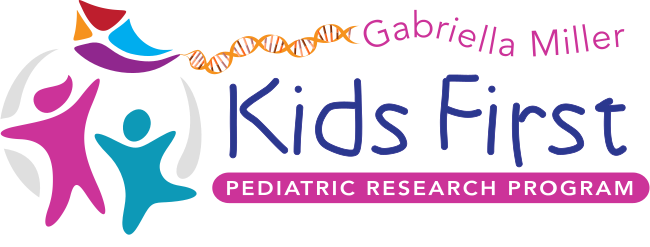
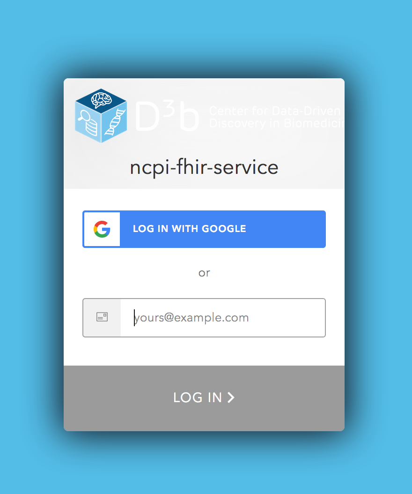
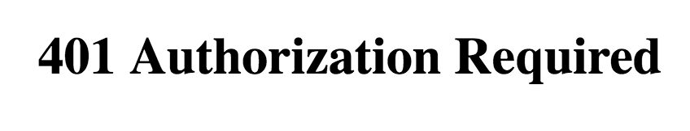
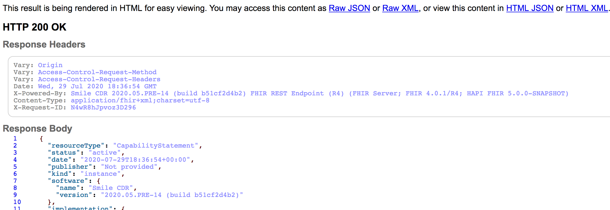

<p align="center">
  
</p>
<p align="center">
  <a href="https://github.com/kids-first/kf-api-fhir-service/blob/master/LICENSE"></a>
  <a href="https://circleci.com/gh/kids-first/kf-api-fhir-service"></a>
</p>

# 🔥 Kids First FHIR Service (Legacy)

FHIR data service for Kids First uses the [Smile CDR FHIR server](https://smilecdr.com/docs/).

## Version

Smile CDR 2021.02.R05 (Odyssey) (See [changelogs](https://smilecdr.com/docs/introduction/changelog.html))

## Quickstart

Kids First FHIR services have been deployed into the three standard environments within the Kids First Strides AWS account: development (DEV), QA, and production (PRD). The FHIR endpoints for each of these environments are:

- Development: https://kf-api-fhir-service-dev.kidsfirstdrc.org
- QA: https://kf-api-fhir-service-qa.kidsfirstdrc.org
- Production: https://kf-api-fhir-service.kidsfirstdrc.org

## 🚧 Server Access

**Note: We recognize that the process for accessing the deployed servers is not very user/developer friendly. This is temporary as we are still working on the NCPI infrastructure and server authentication. Please bear with us!**

In order to interact with these servers, please follow the instrunctions below.

Most users will not need to have an account on the server since the permissions for anonymous HTTP requests allow one to perform any standard FHIR client operation on the server. This means you can create, read, update, delete, and search for FHIR resources on the server.

### DEV/QA

You will need to gain access to the environment/VPC the server runs in. You will do this by tunneling through a bastion host to access the environment:

- Use DEV bastion host for access to development VPC
- Use QA bastion host for access to QA VPC

#### Setup Tunnel

In order to tunnel into the bastion hosts, please follow the instructions [here](https://www.notion.so/d3b/Accessing-kf-strides-569e6a853d5c47c69a3ac00ccd7a89e0).

### PRD

#### Request Access

You will do these steps only one time.

1.  In a browser, go to the production server URL (https://kf-api-fhir-service.kidsfirstdrc.org). Make sure you are signed out of any Google accounts

2.  Click `Login with Google` and try to sign in with a Google account:



3. You will get a page with a `401 Authorization Required` message:



4. Send an email to either [Allison Heath](mailto:heathap@chop.edu), [Alex Lubneuski](mailto:lubneuskia@chop.edu), [Natasha Singh](mailto:singhn4@chop.edu) or [Meen Chul Kim](mailto:kimm11@chop.edu) with the Google account you used before and request access for the server URL you wish to access

5. You will receive an email with confirmation of the access

#### Authenticate to Access Server Environment

You will do this every time your Cookie expires (~1 week).

1. In a browser, go to `https://kf-api-fhir-service.kidsfirstdrc.org/metadata`

2. If successful, you will see a page from the server that shows the server's `CapabilityStatement`:



3. Save the cookie from the response/ The cookie can be found in the response's `Set-Cookie` directive for `AWSELBAuthSessionCookie-0`

#### Send Requests to Server

Although you don't need an account on the server to authenticate with it, you will still need to do something to tell the server you have been granted access to it. When you send HTTP requests to the server make sure to include your `AWSELBAuthSessionCookie-0=yadayada` cookie text in a `Cookie` header as follows:

```bash
curl -X GET https://kf-api-fhir-service.kidsfirstdrc.org/Patient -L --cookie <the cookie>
```

## Demo FHIR Servers

Before moving to the standard service deployment architecture, demo servers are available. For the detailed instructions, please visit [NCPI API FHIR Service](https://github.com/ncpi-fhir/ncpi-api-fhir-service) (restrictions may apply).

## Development

You can experiment locally with the FHIR Docker Compose stack. The services/apps included in this are:

- Smile CDR FHIR services (See [Endpoints](#Endpoints) below)
- PostgresSQL database for the server
- FHIR Data Dashboard web app

### Spin up the Docker Stack

1. Clone this repository

```bash
$ git clone git@github.com:kids-first/kf-api-fhir-service.git
$ cd kf-api-fhir-service
```

2. Get access to the Smile CDR image

   - Create a [Docker Hub](https://hub.docker.com/) account if you don't have one
   - Ask [Natasha Singh](mailto:singhn4@chop.edu) or [Meen Chul Kim](mailto:kimm11@chop.edu) for access to the image (hosted in private Docker Hub repo)

   **🚨 DO NOT distribute the Smile CDR image as it is only for trial use by the internal team!**

3. Set environment variables in a `.env` file (See `server/settings/dev.env` for example)

**Note:**

The `run_local_server.sh` script requires Docker Hub credentials. First it will look for the environment variables `DOCKER_HUB_USERNAME` and `DOCKER_HUB_PW`. If either of these are not set then it will try to source them from the `.env` file.

4. Deploy server and load the [Kids First FHIR Data model](https://github.com/kids-first/kf-model-fhir) (deprecated) into server

```bash
# Deploy server
$ ./scripts/run_local_server.sh

# Load model into server (deprecated)
$ ./scripts/load_kidsfirst.sh
```

You could also run the steps in `run_local_server.sh` manually. It is just a convenience script which does some setup and then runs `docker-compose up -d`.

### Endpoints

#### [FHIR Data Dashboard](https://github.com/kids-first/kf-ui-fhir-data-dashboard)

- A data browser app intended to give users a quick overview of the data in the FHIR server along with the ability to filter FHIR resources and drill down to view specific resources
- {ROOT_URL}:3000

#### [FHIR API](https://smilecdr.com/docs/tutorial_and_tour/fhir_crud_operations.html)

- The main endpoint ingest developers will use to CRUD FHIR resources
- {ROOT_URL}:8000

#### [FHIR Client Web App](https://smilecdr.com/docs/fhir_repository/fhirweb_console.html)

- A web application used to CRUD FHIR resources for those who do not want to write code
- {ROOT_URL}:8001

#### [Smile CDR Admin API](https://smilecdr.com/docs/fhir_repository/fhirweb_console.html)

- The administration endpoint used to change server configuration, user settings, etc.
- {ROOT_URL}:9000

#### [Smile CDR Admin Dashboard](https://smilecdr.com/docs/modules/web_admin_console.html)

- The administration dashboard which is essentially a frontend to the admin API
- {ROOT_URL}:9100

### Start/Stop Services

```bash
# Stop all services
$ docker-compose stop

# Start all services
$ docker-compose start
```

### View Service Logs

Once the services are running you can view logs from all services:

```bash
$ docker-compose logs -f
```

### Reload Kids First FHIR Model (Deprecated)

Run the loader script to reload (DELETE and POST) the Kids First FHIR conformance resources.

The conformance resources are sourced from the `kf-model-fhir` git repository. The default branch that is used for loading is `master`, but you can supply a different branch if you want.

This script will always do a `git pull` to update the branch before loading the resources. This might result in merge errors if you have made changes to the local branch which you will need to resolve (or do a complete wipe out `git reset --hard origin/<branch>`).

```bash
$ ./scripts/load_kidsfirst.sh some-other-branch
```

### Server Settings

#### Properties File

Server settings are controlled by modifying the `server/settings/master.properties` Java properties file. The property strings in the file represent a hierarchical structure of config modules in the Smile CDR. Each module pertains to a logical set of functionality (e.g. persistence) in the server. Read more about the config modules
[here](https://smilecdr.com/docs/json_admin_endpoints/module_config_endpoint.html).

#### Environment Variable Substitution

Property values in the properties file may also be passed in from the environment using the [environment variable substitution expressions](https://smilecdr.com/docs/installation/installing_smile_cdr.html#variable-substitution). This is useful for passing in secrets like DB credentials.

**Note:**

Any settings changed and saved via the Smile CDR Admin Dashboard or the Smile CDR Admin API will be discarded every time the server is re-deployed. This is because the source of truth for the settings is the properties file and NOT the database. However, this behavior can be changed with the [node.propertysource property](https://smilecdr.com/docs/installation/installing_smile_cdr.html#module-property-source).
